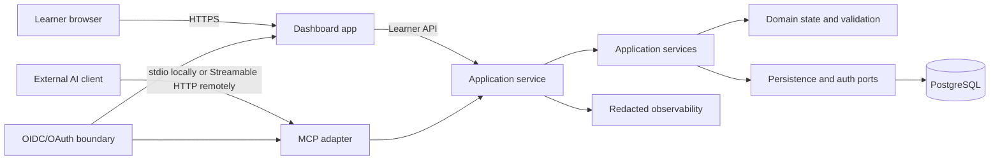

# OpenLearn architecture baseline

**Status:** Accepted for implementation

**Availability:** Planned. This document records the technical baseline; the dashboard, service, persistence, and MCP integration are not implemented in the current repository.

## Purpose

OpenLearn is a standalone dashboard and reusable component surface that an external AI client can use through MCP. The external AI client interprets the learner's request and supplies or revises plan-shaped content. OpenLearn validates that input, stores accepted plan and progress state, and maps it onto OpenLearn-owned components.

The architecture keeps four concerns separate:

- the learner-facing dashboard;
- application and domain state;
- durable and transient storage; and
- the external MCP capability boundary.

The first supported host is the OpenLearn dashboard. A public embeddable component package is a later extension, not a first-release requirement.

## Selected baseline

| Concern | Baseline decision | Boundary it establishes |
| --- | --- | --- |
| Workspace | pnpm workspace with TypeScript | Shared contracts without separate repository coordination |
| Runtime | Node.js 24 LTS | One runtime family for the dashboard tooling and service |
| Dashboard | React application built with Vite | Standalone browser surface and reference consumer of `packages/ui` |
| Service | Node.js service built with Fastify | Learner API and MCP adapter without UI or database coupling |
| Components | First-party React package with CSS custom-property tokens | OpenLearn owns component behavior and state presentation |
| Durable state | PostgreSQL 18 behind persistence ports | Plan revisions, ownership, and progress survive process changes |
| Hosted deployment | Separate OCI-compatible dashboard and service units plus managed PostgreSQL | Independent release and trust boundaries without a vendor lock-in |
| Dashboard identity | OIDC-compatible authenticated session | Internal ownership uses issuer and subject, not provider account data |
| Remote MCP authorization | OAuth 2.1-compatible resource authorization | Remote requests are authenticated, audience-bound, and scoped |
| MCP transport | stdio locally and Streamable HTTP remotely | Local process integrations and remote service integrations use standard modes |

See the [application-stack ADR](architecture/decisions/0001-application-stack-and-workspace.md), [component ADR](architecture/decisions/0002-component-and-design-system-strategy.md), [persistence ADR](architecture/decisions/0003-persistence-and-state-boundary.md), [deployment ADR](architecture/decisions/0004-deployment-and-environments.md), [identity ADR](architecture/decisions/0005-identity-and-authentication.md), and [MCP ADR](architecture/decisions/0006-mcp-connection-and-trust-boundary.md) for rationale and alternatives.

## Boundary map



### Ownership rules

- The connected AI client owns conversation, intent interpretation, and learning-plan content generation or revision.
- The learner owns the learning goal, review of the plan, and the progress actions OpenLearn permits.
- The dashboard owns presentation composition and learner interaction feedback. It does not own domain transitions or persistence.
- The MCP adapter owns protocol registration, transport handling, request mapping, and protocol-level errors. It does not own business rules or database access.
- Application services own authorization checks, use-case coordination, idempotency, transactions, and structured results.
- Domain code owns plan identifiers, lifecycle, progress meaning, ordering, and validation once Phase 4 defines the canonical contract.
- Persistence adapters own SQL, migrations, row mapping, and transaction implementation behind application ports.
- Authentication adapters verify credentials and return minimal actor context. Raw tokens and provider-specific claims stop at the adapter boundary.
- Observability receives correlation IDs and outcome metadata. It does not receive raw prompts, bearer tokens, authorization codes, or full plan content by default.

### Dependency direction

Dependencies point inward:

```text
dashboard UI -> dashboard application -> service API
MCP adapter  -> application ports  -> domain and validation
persistence adapter -> application persistence ports
auth adapter -> application actor context
```

The domain package imports none of the UI, HTTP, MCP, database, or identity-provider packages. The MCP adapter calls application ports rather than repositories. The service composes the adapters and is the only runtime assembly point.

## Logical workspace layout

The initial scaffold should use these package responsibilities:

```text
apps/
  dashboard/       React/Vite browser application
  service/         Fastify learner API and MCP endpoint
packages/
  ui/              First-party React components and presentation tokens
  domain/          Plan state, identifiers, lifecycle, and validation contracts
  application/     Use cases, actor context, ports, and structured results
  persistence/     PostgreSQL adapters and migrations
  mcp/             MCP transport, capability registration, and request mapping
  config/           Shared compiler, lint, and test configuration where useful
```

The exact package names may change during implementation only through a reviewed architecture update. The boundaries must remain visible even if a package is temporarily colocated in the service application.

## Data and request flow

1. The dashboard or MCP adapter receives a request with an actor context established by its authentication boundary.
2. The adapter checks transport requirements, request size, correlation metadata, and capability permissions.
3. An application service validates the command against the versioned domain contract and applies the permitted transition.
4. A persistence transaction writes accepted plan state or learner progress with a revision/concurrency check.
5. The service returns a structured result containing stable identifiers, current status, and safe error information.
6. The dashboard converts query results into view models; the MCP adapter converts the same application result into protocol output.

External content is data, not executable instructions. MCP calls cannot cause arbitrary component code, HTML, JavaScript, SQL, or network destinations to execute. The component registry and state mapping remain OpenLearn-owned code.

## Persistence boundary

PostgreSQL is the durable source of truth for accepted domain state. The eventual schema will cover the concepts required by the Phase 1 journeys:

| Durable category | Purpose |
| --- | --- |
| Ownership reference | Connect a plan to the internal learner or workspace actor |
| Plan identity and revisions | Preserve accepted versions and revision relationships |
| Plan content | Store content that passed the domain validation boundary |
| Learner progress | Store permitted state transitions and current progress |
| Explanation metadata | Preserve the minimum information needed to explain ownership, revision, and progress changes |

MCP sessions, request status, retry/cancellation metadata, capability-discovery caches, and idempotency records are integration state. They may use bounded database records when cross-instance behavior needs them, but they are not learner-domain state and need explicit retention limits. Process memory is never the only source for state needed after a restart.

Raw AI conversations, access tokens, authorization codes, and complete tool payloads are not stored by default. Phase 4 defines the canonical plan schema, and the privacy review defines retention and deletion behavior.

## Identity and authorization boundary

The dashboard uses an OIDC-compatible session. The application maps the verified `(issuer, subject)` pair to an internal actor. Email, display name, AI-provider account IDs, and raw claims are not ownership identifiers.

Remote MCP calls use OAuth 2.1-compatible authorization for the HTTP resource. The service validates the token before application work, checks its audience/resource and scopes, and maps the result to the same internal actor model. Local stdio integrations use documented environment credentials and a client-launched process; a local HTTP listener binds to loopback and does not become an unauthenticated production path.

The caller cannot select another learner by passing an arbitrary actor ID in a tool argument. Missing, expired, audience-mismatched, or insufficiently scoped credentials fail before a plan read or mutation reaches the application service.

## MCP connection model

The official MCP TypeScript SDK is an adapter dependency of `packages/mcp` or `apps/service`, never of `packages/ui` or `packages/domain`.

- **Local:** stdio carries JSON-RPC messages between a client-launched process and the MCP service. Standard output is reserved for protocol messages; diagnostics use standard error.
- **Remote:** Streamable HTTP carries requests to one HTTPS MCP endpoint. The service validates `Origin`, requires authorization, and runs statelessly by default. Any state required for resumability must be externalized and bounded before horizontal scaling.
- **Capabilities:** the first groups are authorized plan-view creation or revision, plan-view retrieval, and learner-authorized progress actions. Exact names, schemas, and result envelopes belong to Phases 4 and 6.
- **Trust:** external content is untrusted; input size, shape, state, ownership, and allowed operations are checked before domain work. Arbitrary markup and code are rejected.
- **Observability:** request ID, capability group, actor class, latency, validation result, and failure category are recorded with sensitive content redacted.

## Deployment and environment model

The deployment target is a container-capable host with separate application units:

```text
TLS / ingress
  ├── dashboard unit -> static browser assets
  └── service unit   -> learner API + MCP endpoint
                           └── managed PostgreSQL 18
```

The implementation defines three isolated environments:

- **Local:** dashboard and service run from the workspace; PostgreSQL runs through a declared local container dependency; MCP clients use stdio; HTTP binds to loopback when needed.
- **Preview:** dashboard, service, and database configuration are isolated from production; fixture data and test identities are allowed; production learner data is not.
- **Production:** dashboard and service use TLS, runtime-injected secrets, a managed PostgreSQL instance, health checks, redacted logs, and a documented recovery path.

No environment depends on an undocumented global database, provider account, or local token. The dashboard must not receive server secrets in its built assets.

## Local development and verification contract

The current repository has no runtime, package manifest, or executable test suite. When the scaffold is added, it must provide:

```text
pnpm install --frozen-lockfile
pnpm dev
pnpm lint
pnpm typecheck
pnpm test
pnpm build
pnpm verify
```

The scaffold must also document the local PostgreSQL dependency, migration/reset command, fixture loading, test identity setup, and the stdio MCP smoke-test command. Verification must run without a live AI provider and must cover contract-shaped fixtures, application state transitions, UI states, and MCP adapter behavior.

## Deliberately deferred

- Phase 3 defines design tokens, responsive layout, accessibility acceptance criteria, and the complete component-state matrix.
- Phase 4 defines the canonical plan schema, identifiers, lifecycle, progress, ordering, and revision semantics.
- Phase 6 defines exact MCP tool names, payloads, result envelopes, retries, cancellation, compatibility behavior, and provider-facing discovery.
- The identity provider, deployment vendor, database host, and package registry are not selected by this baseline.
- Public UI package distribution and semantic-versioning policy wait until an external consumer exists.

## Phase 3 handoff

Phase 3 should design the dashboard as a reference consumer of `packages/ui`. Components should receive explicit view models and expose accessible states for normal, empty, loading, partial, invalid, error, disabled, focus, completed, and learner-confirmed content where applicable. The UX specification should preserve the distinction between external pending input and learner-confirmed progress without introducing transport, database, or provider concerns into component props.

## References

- [Node.js release guidance](https://nodejs.org/en/about/previous-releases)
- [React TypeScript guidance](https://react.dev/learn/typescript)
- [Vite library mode](https://vite.dev/guide/build.html#library-mode)
- [Fastify TypeScript reference](https://fastify.dev/docs/latest/Reference/TypeScript/)
- [pnpm workspaces](https://pnpm.io/workspaces)
- [PostgreSQL supported versions](https://www.postgresql.org/support/versioning/)
- [MCP transport specification](https://modelcontextprotocol.io/specification/2025-11-25/basic/transports)
- [MCP authorization specification](https://modelcontextprotocol.io/specification/2025-11-25/basic/authorization)
- [MCP TypeScript SDK server guidance](https://ts.sdk.modelcontextprotocol.io/server)
