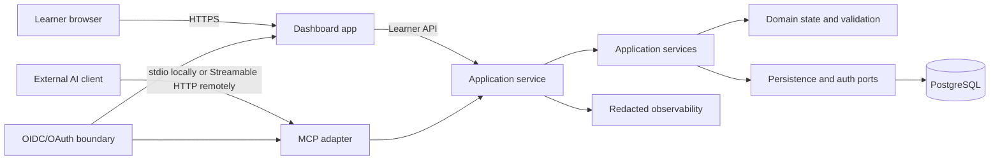

# OpenLearn architecture baseline

**Status:** Accepted for implementation

**Availability:** Planned. This document records the technical baseline; the dashboard, service, persistence, and MCP integration are not implemented in the current repository.

## Purpose

OpenLearn is a standalone dashboard and reusable component surface that an external AI client can use through MCP. The external AI client interprets the learner's request and supplies or revises plan-shaped content. OpenLearn validates that input, stores accepted plan and progress state, and maps it onto OpenLearn-owned components.

The architecture keeps four concerns separate:

- the learner-facing dashboard;
- application and domain state;
- durable and transient storage; and
- the external MCP capability boundary.

The first supported host is the OpenLearn dashboard. A public embeddable component package is a later extension, not a first-release requirement.

## Selected baseline

| Concern | Baseline decision | Boundary it establishes |
| --- | --- | --- |
| Workspace | pnpm workspace with TypeScript | Shared contracts without separate repository coordination |
| Runtime | Node.js 24 LTS | One runtime family for the dashboard tooling and service |
| Dashboard | React application built with Vite | Standalone browser surface and reference consumer of `packages/ui` |
| Service | Node.js service built with Fastify | Learner API and MCP adapter without UI or database coupling |
| Components | First-party React package with CSS custom-property tokens | OpenLearn owns component behavior and state presentation |
| Durable state | PostgreSQL 18 behind persistence ports | Plan revisions, ownership, and progress survive process changes |
| Hosted deployment | Separate OCI-compatible dashboard and service units plus managed PostgreSQL | Independent release and trust boundaries without a vendor lock-in |
| Dashboard identity | OIDC-compatible authenticated session | Internal ownership uses issuer and subject, not provider account data |
| Remote MCP authorization | OAuth 2.1-compatible resource authorization | Remote requests are authenticated, audience-bound, and scoped |
| Hosted principal association | One configured identity authority and canonical issuer for dashboard and remote MCP | Both entry points resolve to one internal owner without implicit cross-provider matching |
| MCP transport | stdio locally and Streamable HTTP remotely | Local process integrations and remote service integrations use standard modes |

See the [application-stack ADR](architecture/decisions/0001-application-stack-and-workspace.md), [component ADR](architecture/decisions/0002-component-and-design-system-strategy.md), [persistence ADR](architecture/decisions/0003-persistence-and-state-boundary.md), [deployment ADR](architecture/decisions/0004-deployment-and-environments.md), [identity ADR](architecture/decisions/0005-identity-and-authentication.md), and [MCP ADR](architecture/decisions/0006-mcp-connection-and-trust-boundary.md) for rationale and alternatives.

## Boundary map



### Ownership rules

- The connected AI client owns conversation, intent interpretation, and learning-plan content generation or revision.
- The learner owns the learning goal, review of the plan, and the progress actions OpenLearn permits.
- The dashboard owns presentation composition and learner interaction feedback. It does not own domain transitions or persistence.
- The MCP adapter owns protocol registration, transport handling, request mapping, and protocol-level errors. It does not own business rules or database access.
- Application services own authorization checks, use-case coordination, idempotency, transactions, and structured results.
- Domain code owns plan identifiers, lifecycle, progress meaning, ordering, and validation once Phase 4 defines the canonical contract.
- Persistence adapters own SQL, migrations, row mapping, and transaction implementation behind application ports.
- Authentication adapters verify credentials and return minimal actor context. Raw tokens and provider-specific claims stop at the adapter boundary.
- Observability receives correlation IDs and outcome metadata. It does not receive raw prompts, bearer tokens, authorization codes, or full plan content by default.

### Dependency direction

Dependencies point inward:

```text
dashboard UI -> dashboard application -> service API
MCP adapter  -> application ports  -> domain and validation
persistence adapter -> application persistence ports
auth adapter -> application actor context
```

The domain package imports none of the UI, HTTP, MCP, database, or identity-provider packages. The MCP adapter calls application ports rather than repositories. The service composes the adapters and is the only runtime assembly point.

## Logical workspace layout

The initial scaffold should use these package responsibilities:

```text
apps/
  dashboard/       React/Vite browser application
  service/         Fastify learner API and MCP endpoint
packages/
  ui/              First-party React components and presentation tokens
  domain/          Plan state, identifiers, lifecycle, and validation contracts
  application/     Use cases, actor context, ports, and structured results
  persistence/     PostgreSQL adapters and migrations
  mcp/             MCP transport, capability registration, and request mapping
  config/           Shared compiler, lint, and test configuration where useful
```

The exact package names may change during implementation only through a reviewed architecture update. The boundaries must remain visible even if a package is temporarily colocated in the service application.

## Data and request flow

1. The dashboard or MCP adapter receives a request with an actor context established by its authentication boundary.
2. The adapter checks transport requirements, request size, correlation metadata, and capability permissions.
3. An application service validates the command against the versioned domain contract and applies the permitted transition.
4. A persistence transaction writes accepted plan state or learner progress with a revision/concurrency check.
5. The service returns a structured result containing stable identifiers, current status, a dashboard handoff when a plan view exists, and safe error information.
6. The dashboard converts query results into view models; the MCP adapter converts the same application result into protocol output.

External content is data, not executable instructions. MCP calls cannot cause arbitrary component code, HTML, JavaScript, SQL, or network destinations to execute. The component registry and state mapping remain OpenLearn-owned code.

## Persistence boundary

PostgreSQL is the durable source of truth for accepted domain state. The eventual schema will cover the concepts required by the Phase 1 journeys:

| Durable category | Purpose |
| --- | --- |
| Ownership reference | Connect a plan to the internal learner or workspace actor |
| Plan identity and revisions | Preserve accepted versions and revision relationships |
| Plan content | Store content that passed the domain validation boundary |
| Learner progress | Store permitted state transitions and current progress |
| Explanation metadata | Preserve the minimum information needed to explain ownership, revision, and progress changes |

MCP sessions, request status, retry/cancellation metadata, capability-discovery caches, and idempotency records are integration state. They may use bounded database records when cross-instance behavior needs them, but they are not learner-domain state and need explicit retention limits. Process memory is never the only source for state needed after a restart.

Raw AI conversations, access tokens, authorization codes, and complete tool payloads are not stored by default. Plan content is stored only after validation in its canonical form.

### Initial retention and deletion assumptions

These are the minimum product assumptions for the first implementation. Phase 9 must verify them against the final deployment, privacy review, and applicable obligations; it must not replace them with an undefined policy after schema work begins.

- Accepted plan revisions and learner progress remain available while the learner's account and plan exist. The minimum product has no inactivity expiry because returning-user access is a core journey.
- A learner-initiated plan deletion immediately removes the plan from dashboard reads and rejects further reads or mutations for that plan. The primary durable content, revisions, and progress are purged within 24 hours of the deletion request. A minimal deletion tombstone may remain only to prevent stale retries or backup restores from resurrecting the plan.
- Account deletion uses the same access revocation and purge behavior for all plans owned by the account. Backups must expire or be scrubbed within 35 days; a restore must replay deletion tombstones before serving learner data.
- Pending, rejected, and expired request payloads are not retained as learner content. Full lifecycle records and replay response details expire 24 hours after terminal completion or expiration. Every mutation also creates a minimal deduplication marker containing only an owner/capability/key scope digest, request-fingerprint digest, terminal outcome, operation ID, and resource reference; it contains no request payload or bearer token and remains while the owning account exists. After account deletion, the marker remains with the deletion tombstone for 35 days so stale retries are rejected rather than treated as new mutations. Discovery and authorization caches have a maximum 24-hour lifetime and contain no bearer tokens.
- Redacted operational telemetry is retained for 30 days. Minimal security and ownership audit metadata is retained for 90 days. Neither category contains raw prompts, access tokens, authorization codes, or complete plan content by default.

Learner-control invariants are stable across transports: every read or mutation is scoped to the resolved internal owner; an invalid, pending, cancelled, or failed revision cannot replace the last accepted state; a stale or replayed operation cannot restore a deleted plan; and a new plan after deletion requires a new authorized operation. Dashboard deletion is a learner action in the first release; no public or anonymous URL grants access.

## Identity and authorization boundary

The dashboard uses an OIDC-compatible session. The authentication adapter maps the verified external principal `(issuer, subject)` to an internal `owner_id`; domain records reference that internal owner. Email, display name, AI-provider account IDs, and raw claims are not ownership identifiers.

Remote MCP calls use OAuth 2.1-compatible authorization for the HTTP resource. The service validates the token before application work, checks its audience/resource and scopes, and maps the result to the same internal actor model. For the first hosted release, the dashboard OIDC session and remote MCP authorization flow must use one configured identity authority and canonical issuer. Their subject values must match for the same learner; audience and client identifiers may differ.

A remote token from a different issuer is rejected for owner-bound operations. OpenLearn does not match principals by email, display name, AI-provider account, or an equal subject value from another issuer. The first hosted release has no implicit account linking. If multiple authorities become necessary, a future authenticated dashboard flow must have the learner authorize and confirm the second principal, then store a unique, auditable, revocable mapping to the existing `owner_id` before that principal can access learner state.

Local stdio integrations use documented environment credentials and a client-launched process; a local HTTP listener binds to loopback and does not become an unauthenticated production path. Local identities are development-only and never establish production ownership.

The caller cannot select another learner by passing an arbitrary actor ID in a tool argument. Missing, expired, wrong-issuer, audience-mismatched, or insufficiently scoped credentials fail before a plan read or mutation reaches the application service.

## Dashboard handoff

An accepted plan-view creation or revision returns a stable, opaque plan reference and an authenticated dashboard handoff. The conceptual handoff contains:

- the stable `plan_id`;
- a `dashboard_url` formed by the service from a configured public dashboard origin and the route `/plans/{plan_id}`; and
- the current plan or operation status needed to explain whether the view is accepted, pending, or requires recovery.

The service, not the MCP caller, chooses the dashboard origin and route. The URL never embeds a bearer token, raw plan content, or a caller-supplied redirect destination. The exact MCP field names and result envelope are Phase 6 contract work, but every successful plan-view mutation must expose this handoff information.

The calling AI client is responsible for presenting the returned link or reference in its conversation so the learner can open it. OpenLearn does not own the AI conversation, send a message to the learner, or assume that the client can open a browser. A learner who follows the link is sent through dashboard authentication if needed and then returned to `/plans/{plan_id}`. The dashboard service authorizes that plan against the signed-in `owner_id`; an unrecognized owner receives a non-disclosing not-found or forbidden result.

The authenticated dashboard landing route `/plans` lists the learner's owned plans and their current statuses. The direct handoff route is the first-run path; the plan list is the returning-user fallback. If a mutation is pending, rejected, cancelled, expired, or fails, the last accepted plan URL remains usable and the result includes the operation status and recovery direction. A new plan with no accepted state shows a pending or empty recovery state, never fabricated content. There are no anonymous production share links.

## MCP connection model

The official MCP TypeScript SDK is an adapter dependency of `packages/mcp` or `apps/service`, never of `packages/ui` or `packages/domain`.

- **Local:** stdio carries JSON-RPC messages between a client-launched process and the MCP service. Standard output is reserved for protocol messages; diagnostics use standard error.
- **Remote:** Streamable HTTP carries requests to one HTTPS MCP endpoint. The service validates `Origin`, requires authorization, and runs statelessly by default. Any state required for resumability must be externalized and bounded before horizontal scaling.
- **Capabilities:** the first groups are authorized plan-view creation or revision, plan-view retrieval, and learner-authorized progress actions. Exact names, schemas, and result envelopes belong to Phases 4 and 6.
- **Trust:** external content is untrusted; input size, shape, state, ownership, and allowed operations are checked before domain work. Arbitrary markup and code are rejected.
- **Discovery:** after protocol initialization, standard capability discovery exposes only operations allowed for the authenticated actor and server contract version. Discovery contains no learner data; protected operations are not usable without the required authorization.
- **Lifecycle:** every mutation receives an opaque operation ID and a required idempotency key. Its bounded states are `received`, `in_progress`, `succeeded`, `rejected`, `failed_retryable`, `cancelled`, `expired`, or `conflict`; only terminal outcomes are replayed as final results.
- **Timeout:** the first synchronous implementation uses a bounded request deadline, with a 30-second target. If the deadline expires before commit, the transaction is rolled back and the operation is retryable. If commit status is uncertain because the response was lost, the same idempotency key resolves the original outcome rather than creating a second mutation.
- **Cancellation:** cancellation is honored while an operation is in progress and before its domain transaction commits. After commit, cancellation cannot roll back learner state and returns the committed outcome. A transport disconnect is only a best-effort cancellation signal.
- **Duplicates and retries:** reads may be retried. Mutations are retried only with the same owner, capability, idempotency key, and request fingerprint; a matching key replays or returns the in-progress operation, while a changed fingerprint is a conflict. Full operation details may expire after 24 hours, but the minimal key-to-outcome marker remains while the owning account exists and for 35 days after account deletion. It replays a committed result or returns a terminal non-creation outcome and never starts a fresh mutation for a previously seen key. Mutations without an idempotency key are rejected.
- **State preservation:** `rejected`, `failed_retryable`, `cancelled`, `expired`, and `conflict` outcomes do not replace the last accepted plan. A stale revision is a conflict requiring a fresh read, not an automatic overwrite.
- **Observability:** request ID, operation ID, capability group, actor class, lifecycle transition, latency, validation result, and failure category are recorded with sensitive content redacted.

## Deployment and environment model

The deployment target is a container-capable host with separate application units:

```text
TLS / ingress
  ├── dashboard unit -> static browser assets
  └── service unit   -> learner API + MCP endpoint
                           └── managed PostgreSQL 18
```

The implementation defines three isolated environments:

- **Local:** dashboard and service run from the workspace; PostgreSQL runs through a declared local container dependency; MCP clients use stdio; HTTP binds to loopback when needed.
- **Preview:** dashboard, service, and database configuration are isolated from production; fixture data and test identities are allowed; production learner data is not.
- **Production:** dashboard and service use TLS, runtime-injected secrets, a managed PostgreSQL instance, health checks, redacted logs, and a documented recovery path.

No environment depends on an undocumented global database, provider account, or local token. The dashboard must not receive server secrets in its built assets.

## Local development and verification contract

The current repository has no runtime, package manifest, or executable test suite. When the scaffold is added, it must provide:

```text
pnpm install --frozen-lockfile
pnpm dev
pnpm lint
pnpm typecheck
pnpm test
pnpm build
pnpm verify
```

The scaffold must also document the local PostgreSQL dependency, migration/reset command, fixture loading, test identity setup, and the stdio MCP smoke-test command. Verification must run without a live AI provider and must cover contract-shaped fixtures, application state transitions, UI states, and MCP adapter behavior.

## Deliberately deferred

- Phase 3 defines design tokens, responsive layout, accessibility acceptance criteria, and the complete component-state matrix.
- Phase 4 defines the canonical plan schema, exact identifiers, lifecycle fields, progress, ordering, and revision semantics within the ownership, retention, handoff, and mutation rules above.
- Phase 6 defines exact MCP tool names, payloads, result envelopes, protocol cancellation wiring, compatibility behavior, and provider-facing discovery within the lifecycle rules above. It may tune bounded values such as the request deadline only with a documented contract change.
- The identity provider, deployment vendor, database host, and package registry are not selected by this baseline.
- Public UI package distribution and semantic-versioning policy wait until an external consumer exists.

## Phase 3 handoff

Phase 3 should design the dashboard as a reference consumer of `packages/ui`. Components should receive explicit view models and expose accessible states for normal, empty, loading, partial, invalid, error, disabled, focus, completed, learner-confirmed, pending, interrupted, cancelled, and retryable content where applicable. The UX specification should include the `/plans` landing flow, the authenticated `/plans/{plan_id}` handoff route, and the distinction between external operation state and learner-confirmed progress without introducing transport, database, or provider concerns into component props.

## References

- [Node.js release guidance](https://nodejs.org/en/about/previous-releases)
- [React TypeScript guidance](https://react.dev/learn/typescript)
- [Vite library mode](https://vite.dev/guide/build.html#library-mode)
- [Fastify TypeScript reference](https://fastify.dev/docs/latest/Reference/TypeScript/)
- [pnpm workspaces](https://pnpm.io/workspaces)
- [PostgreSQL supported versions](https://www.postgresql.org/support/versioning/)
- [MCP transport specification](https://modelcontextprotocol.io/specification/2025-11-25/basic/transports)
- [MCP authorization specification](https://modelcontextprotocol.io/specification/2025-11-25/basic/authorization)
- [MCP TypeScript SDK server guidance](https://ts.sdk.modelcontextprotocol.io/server)
