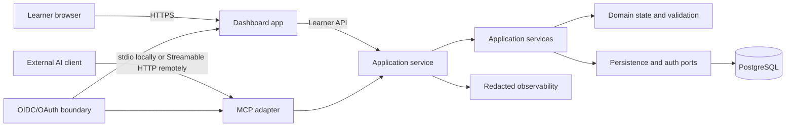

# OpenLearn Architecture Baseline Design

**Status:** Approved for implementation

**Scope:** Phase 2: Architecture and technology decisions

## Goal

Define a portable technical baseline for OpenLearn's standalone learner dashboard, reusable component package, durable plan state, and external AI-client capability surface.

## Context

OpenLearn is not the system that interprets a learner's request or generates curriculum. A connected AI client performs that work and calls OpenLearn through MCP. OpenLearn validates plan-shaped input, manages accepted state and learner progress, and renders that state through reusable components.

The repository currently contains documentation only. This design records the boundaries that the implementation phases must preserve without claiming that the application, persistence, dashboard, or MCP service is available today.

## Selected approach

Use a pnpm workspace with TypeScript across the runtime. Build the standalone dashboard as a React application with Vite. Build a separate Node.js service with Fastify for the learner-facing HTTP API and MCP adapter. Keep domain, application, UI, persistence, and MCP concerns in separate packages so the two deployable applications share contracts without sharing transport or storage internals.

Use PostgreSQL 18 as the durable store. Deploy the dashboard and service as separate OCI-compatible units with a managed PostgreSQL instance in hosted environments. Use OIDC-compatible dashboard sessions and OAuth 2.1-compatible authorization for remote MCP requests. Use stdio for client-launched local integrations and Streamable HTTP for remote integrations through the official MCP TypeScript SDK.

The remote MCP endpoint is stateless by default. Every tool call is authenticated, scoped, validated, and routed to an application service. It cannot access the database directly, execute generated code, or select arbitrary UI markup. The UI chooses from OpenLearn-owned components based on validated domain state.

## Decision summary

| Concern | Decision | Primary consequence |
| --- | --- | --- |
| Workspace and runtime | pnpm workspace; TypeScript; Node.js 24 LTS | Shared types and tooling across independently deployable applications |
| Dashboard | React + Vite standalone application | Fast component iteration and a clear browser boundary without server-rendering requirements |
| Service | Node.js + Fastify service | One typed service boundary for learner HTTP operations and MCP adaptation |
| Components | First-party React package with CSS custom-property tokens | OpenLearn owns the visual primitives and avoids an early UI-kit lock-in |
| Durable state | PostgreSQL 18 behind persistence ports | Transactions, ownership, revisions, and progress survive process or instance changes |
| Deployment | Separate dashboard and service OCI units plus managed PostgreSQL | Independent scaling and clear trust boundaries without a cloud-provider lock-in |
| Dashboard identity | OIDC-compatible browser session | Domain identity uses issuer and subject, not email or AI-provider identity |
| Remote MCP auth | OAuth 2.1-compatible resource authorization | Tool calls are scoped to a resource and acting identity |
| Hosted principal association | One configured identity authority and canonical issuer for dashboard and remote MCP | Both entry points resolve to one internal owner without implicit cross-provider matching |
| MCP transports | stdio locally; Streamable HTTP remotely | Local client compatibility and a current remote transport with one service endpoint |

## Boundary map

The architecture is organized around dependencies pointing inward toward domain and application ports:



The dependency rules are:

- Dashboard components may consume UI view models and invoke typed learner-action ports. They do not import MCP transport objects, database clients, access tokens, or provider SDKs.
- The dashboard application may call the service's learner API. It does not connect directly to PostgreSQL or to an external AI client.
- The MCP adapter translates protocol requests into application commands and query requests. It does not contain business rules and does not access persistence directly.
- Application services coordinate authorization, validation, domain transitions, persistence transactions, idempotency, and structured results.
- Domain code owns plan lifecycle, learner-progress semantics, identifiers, ordering, and validation rules once Phase 4 defines them. It imports no UI, transport, or database package.
- Persistence adapters implement ports defined outside the database package. They may map domain records to PostgreSQL rows but may not leak row models into the UI or MCP adapter.
- Authentication adapters verify external credentials and return a minimal internal actor context. Domain code receives an actor and permissions, not raw tokens or provider-specific claims.
- Observability receives event metadata and outcome codes with correlation identifiers. It does not receive raw prompts, bearer tokens, or full plan content by default.

## Logical workspace layout

The scaffold should use these responsibilities; exact package names can be adjusted only with an architecture record:

```text
apps/
  dashboard/       React/Vite browser application
  service/         Fastify HTTP API and MCP endpoint
packages/
  ui/              First-party React components and presentation tokens
  domain/          Plan state, identifiers, lifecycle, and validation contracts
  application/     Use cases, actor context, ports, and structured results
  persistence/     PostgreSQL adapters and migrations
  mcp/             MCP transport/registration adapter and request mapping
  config/           Shared TypeScript, lint, and test configuration where useful
```

The UI package may depend on shared domain-facing view-model types, but the domain and application packages must not depend on `ui`. The MCP package may depend on application ports and contract types, but the application package must not depend on MCP. The service application composes adapters; it is the only package allowed to assemble the full runtime graph.

## State and request flow

1. A dashboard request or MCP tool call arrives with an actor context established by the relevant authentication boundary.
2. The adapter checks transport-level requirements, request size, correlation metadata, and capability permissions.
3. The application service validates the command against the versioned domain contract and applies the permitted state transition.
4. A persistence transaction writes accepted domain state and its revision or progress change together with the terminal operation outcome and minimal deduplication marker. Duplicate requests use an idempotency key or equivalent version check.
5. The service returns a structured result containing the outcome, stable identifiers, current state, a dashboard handoff when a plan view exists, and safe learner-facing or client-facing error information.
6. The dashboard converts query results into view models and renders the appropriate component state. The MCP adapter converts the same application result into protocol-shaped output.

MCP requests must never cause arbitrary component code, HTML, JavaScript, or database queries to execute. Plan content is data. The component registry and state mapping remain OpenLearn-owned code.

## Ownership association and dashboard handoff

The authentication layer maps a verified external principal `(issuer, subject)` to an internal `owner_id`. Domain records use that internal owner. For the first hosted release, the dashboard OIDC session and remote MCP authorization flow must use one configured identity authority and canonical issuer. The same learner's subject must therefore resolve to the same `owner_id`; audience and client identifiers may differ.

An MCP token from another issuer is rejected for owner-bound operations. OpenLearn does not match by email, display name, AI-provider account, or equal subject values from different issuers. A future multi-authority design would require an authenticated dashboard-initiated link, authorization and explicit learner confirmation for the second principal, and a unique, auditable, revocable `(issuer, subject)` to `owner_id` mapping. No implicit cross-provider linking is part of the first hosted release.

When a plan-view creation or revision is accepted, the result includes a conceptual dashboard handoff: an opaque stable `plan_id`, a `dashboard_url` formed from a configured public dashboard origin and `/plans/{plan_id}`, and the current plan or operation status. The service controls the origin and never puts a token or plan content in the URL. Exact MCP field names remain Phase 6 contract work.

The calling AI client presents that link or reference in its conversation. OpenLearn does not send the learner a message or assume that the client can open a browser. The link sends the learner through dashboard authentication if needed and back to the plan route. The dashboard authorizes the route against the signed-in `owner_id`; an unrelated owner receives a non-disclosing result. The authenticated `/plans` route lists the learner's plans as the returning-user fallback.

## Retention and learner-control assumptions

The first implementation uses these minimum retention assumptions. They are not claims that the documentation-only repository enforces them; Phase 9 verifies the implementation against the privacy review and applicable obligations:

- Accepted plan revisions and learner progress remain available while the account and plan exist. There is no inactivity expiry in the minimum product.
- Plan deletion immediately hides the plan and rejects dashboard and MCP reads or mutations. Primary plan content, revisions, and progress are purged within 24 hours. A minimal deletion tombstone may remain only to prevent stale retries or backup restores from resurrecting the plan.
- Account deletion applies the same revocation and purge path to every owned plan. Backups expire or are scrubbed within 35 days, and restore procedures replay deletion tombstones before serving data.
- Pending, rejected, and expired request payloads are not retained as learner content. Full lifecycle records and replay response details expire 24 hours after terminal completion or expiration. Every mutation also creates a minimal deduplication marker containing an owner/capability/key scope digest, request-fingerprint digest, terminal outcome, operation ID, and resource reference; it contains no request payload or bearer token and remains while the owning account exists. After account deletion, the marker remains with the deletion tombstone for 35 days so stale retries are rejected rather than treated as new mutations. Discovery and authorization caches live no longer than 24 hours and contain no bearer tokens.
- Redacted operational telemetry is retained for 30 days; minimal security and ownership audit metadata is retained for 90 days. Neither contains raw prompts, access tokens, authorization codes, or complete plan content by default.

Learner-control invariants are transport-independent: all reads and mutations use the resolved internal owner; invalid, pending, cancelled, failed, or stale work cannot replace the last accepted state; old operations and idempotency keys cannot resurrect deleted plans; and a new plan after deletion requires a new authorized operation. Dashboard deletion is a learner action in the first release, and production has no anonymous share links.

## MCP lifecycle contract

After protocol initialization, standard capability discovery exposes only operations allowed for the authenticated actor and advertised contract version, without learner data. The first capability groups are plan-view creation or revision, authorized plan-view retrieval, and learner-authorized progress actions.

Every mutation has an opaque operation ID, a required idempotency key, a deadline, a recovery lease, and a fencing version. The bounded state machine is:

```text
received -> in_progress -> succeeded
                      |-> rejected
                      |-> failed_retryable
                      |-> cancelled
                      |-> expired
                      |-> conflict
                      `-> reconciling -> succeeded
                                      `-> expired
```

`rejected` covers validation or authorization without a domain write. `failed_retryable` means no commit occurred and the same idempotency key may be retried. `expired` means the bounded deadline or recovery lease elapsed before a domain commit was found. `cancelled` means cancellation was accepted before commit. `conflict` means stale state or a changed request fingerprint for an existing key. `reconciling` is entered after an `in_progress` lease expires and is bounded by the recovery attempt. `in_progress` and `reconciling` are non-terminal.

The first synchronous implementation uses a bounded request deadline with a 30-second target and a recovery lease that expires after a bounded 10-second grace period. A same-key request before lease expiry returns `in_progress`; a same-key request after lease expiry or a bounded startup/maintenance sweep claims `reconciling` with compare-and-set and a fencing version. Reconciliation checks the durable mutation or mutation-ledger entry by operation ID and request-fingerprint digest: a matching committed entry becomes `succeeded`, while no matching entry becomes `expired` with no domain write. The final domain mutation, terminal outcome, and deduplication marker are committed together, and an old worker cannot finalize after takeover. Cancellation is honored before commit; after commit it cannot roll back state and returns the committed outcome. Reads may be retried. Mutations retry only with the same owner, capability, idempotency key, and request fingerprint; matching keys replay or return the existing operation while full operation details exist, changed fingerprints conflict, and mutations without a key are rejected. A retryable failure may be retried with the same key only while its full operation record is available. A transport disconnect is only a best-effort cancellation signal. Full lifecycle and response details expire 24 hours after completion or expiration, but the minimal key-to-outcome marker remains while the owning account exists and for 35 days after account deletion. It replays committed outcomes or returns terminal non-creation outcomes and never turns a previously seen key into a fresh mutation. Failure, cancellation, expiration, and conflict preserve the last accepted plan.

## Environment model

The implementation must define three environments:

- **Local:** dashboard and service run from the workspace; PostgreSQL is supplied by a declared local container or an explicitly documented local alternative; local MCP clients use stdio and the service binds only to loopback when HTTP is needed.
- **Preview:** a disposable dashboard and service deployment uses an isolated database and non-production credentials; it may use fixture data and test identities but must not share learner data with production.
- **Production:** dashboard and service use separate deployment units, TLS, a managed PostgreSQL instance, runtime-injected secrets, monitored health endpoints, and privacy-aware logs.

No environment may depend on a developer's undocumented global database, provider account, or locally stored token. The implementation must pin the Node and package-manager versions and provide reproducible setup and verification commands.

## Deliberately deferred decisions

- Phase 3 defines design tokens, responsive behavior, accessibility acceptance criteria, and the complete component-state inventory.
- Phase 4 defines the canonical plan schema, exact identifier fields, lifecycle fields, progress semantics, and version envelope within the ownership, retention, handoff, and mutation rules above.
- Phase 6 defines exact MCP tool names, payloads, result envelopes, protocol cancellation wiring, and provider-facing compatibility behavior within the lifecycle contract above. It may tune bounded values such as the request deadline only through a documented contract change.
- The identity-provider vendor, deployment vendor, database host, and package registry are not selected by this baseline.
- Public distribution and semantic-versioning rules for the UI package are deferred until a consumer outside the dashboard exists.

## Phase 3 handoff

Phase 3 can design the dashboard against a stable ownership boundary: React components render explicit view models supplied by the dashboard application, while pending, partial, invalid, failed, cancelled, interrupted, recovering, retryable, and learner-confirmed states remain visible. It should include the authenticated `/plans` landing route and `/plans/{plan_id}` handoff route without introducing MCP request objects, authentication claims, or database records into component props.

## References

- [Node.js release guidance](https://nodejs.org/en/about/previous-releases)
- [React TypeScript guidance](https://react.dev/learn/typescript)
- [Vite library mode](https://vite.dev/guide/build.html#library-mode)
- [Fastify TypeScript reference](https://fastify.dev/docs/latest/Reference/TypeScript/)
- [pnpm workspaces](https://pnpm.io/workspaces)
- [PostgreSQL supported versions](https://www.postgresql.org/support/versioning/)
- [MCP transport specification](https://modelcontextprotocol.io/specification/2025-11-25/basic/transports)
- [MCP authorization specification](https://modelcontextprotocol.io/specification/2025-11-25/basic/authorization)
- [MCP TypeScript SDK server guidance](https://ts.sdk.modelcontextprotocol.io/server)
